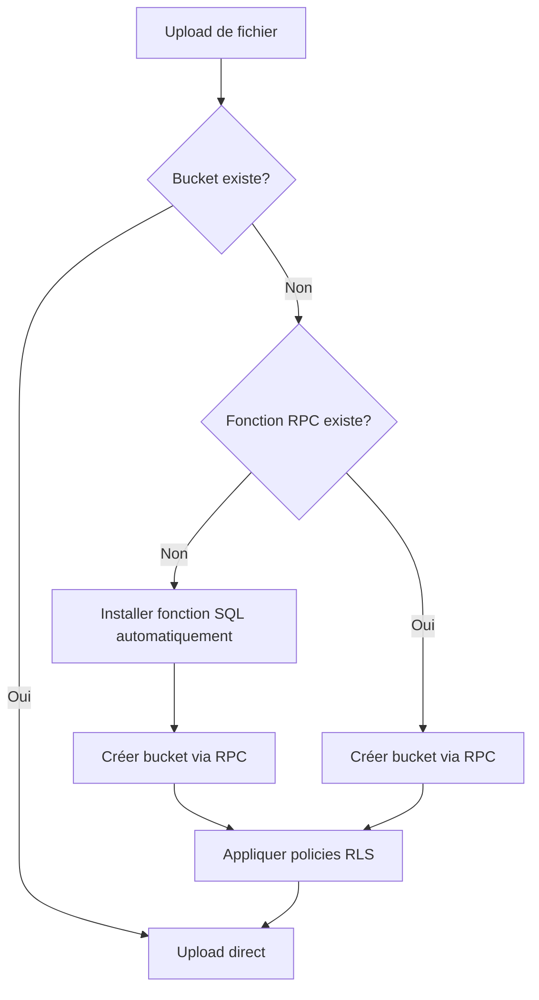

# ✅ Solution Complète : Création Automatique du Bucket Attachments

## 🎯 Problème Résolu

**Erreur initiale :**
```
Could not find the function public.create_attachments_bucket without parameters in the schema cache.
```

**Solution implémentée :** Autoconfiguration complète du bucket `attachments` avec fonction RPC et policies RLS, sans intervention manuelle dans le Dashboard Supabase.

---

## 🚀 Comment ça Fonctionne

### Flux d'Autoconfiguration



### Étapes Automatiques

1. **Détection du bucket manquant**
   - Vérifie si le bucket `attachments` existe
   - Si absent, déclenche l'installation automatique

2. **Installation de la fonction RPC**
   ```sql
   create or replace function public.create_attachments_bucket()
   returns void
   language plpgsql
   security definer
   as $$
   begin
     insert into storage.buckets (id, name, public)
     values ('attachments', 'attachments', true)
     on conflict (id) do nothing;
   end;
   $$;
   ```

3. **Création du bucket**
   - Appelle la fonction RPC avec privilèges admin (SECURITY DEFINER)
   - Crée le bucket public `attachments`

4. **Application des policies RLS**
   ```sql
   -- Lecture publique
   create policy "Public Access to attachments"
   on storage.objects for select 
   using (bucket_id = 'attachments');

   -- Écriture authentifiée
   create policy "Allow insert for authenticated users"
   on storage.objects for insert 
   with check (bucket_id = 'attachments');

   -- Suppression authentifiée
   create policy "Allow delete for authenticated users"
   on storage.objects for delete 
   using (bucket_id = 'attachments');
   ```

---

## 📦 Configuration Requise

### 1. Ajouter la Clé de Service Supabase

**Dans `.env.local` :**
```bash
VITE_SUPABASE_SERVICE_KEY=eyJhbGc...votre_service_role_key
```

**⚠️ IMPORTANT :**
- **NE JAMAIS** commiter cette clé dans Git
- Utilisez cette clé **uniquement côté serveur** (ou dev local)
- C'est une clé avec privilèges admin

**Où la trouver :**
1. Allez dans [Supabase Dashboard](https://app.supabase.com)
2. Sélectionnez votre projet : `fhuzkubnxuetakpxkwlr`
3. Menu : **Settings** > **API**
4. Copiez la clé : **`service_role` key (secret)**

### 2. Vérifier le fichier `.gitignore`

Assurez-vous que `.env.local` est ignoré :
```gitignore
.env.local
.env*.local
```

---

## 🔧 Modifications Apportées

### Fichier : `src/lib/uploadManager.js`

#### Nouvelles Fonctions

1. **`ensureAttachmentsBucket(silent)`**
   - Détecte et crée automatiquement le bucket
   - Gère l'installation de la fonction RPC si absente
   - Applique les policies RLS

2. **`installRpcFunction(silent)`**
   - Crée la fonction SQL `create_attachments_bucket`
   - Utilise l'API REST de Supabase avec la `service_role` key
   - Tentative primaire : `/rest/v1/rpc/exec_sql`
   - Fallback : `/rest/v1/rpc/query`

3. **`installRpcFunctionAlternative(silent)`**
   - Méthode alternative si `exec_sql` n'existe pas
   - Même SQL, endpoint différent

4. **`applyStoragePolicies(silent)`**
   - Crée automatiquement les 3 policies RLS
   - Lecture publique + écriture/suppression authentifiée

#### Détection Intelligente

```javascript
const { error: rpcError } = await supabase.rpc('create_attachments_bucket');

if (rpcError?.message?.includes('Could not find the function')) {
  // Installation automatique de la fonction
  await installRpcFunction(silent);
  
  // Réessayer la création du bucket
  await supabase.rpc('create_attachments_bucket');
  
  // Appliquer les policies
  await applyStoragePolicies(silent);
}
```

---

## 🧪 Tests Attendus

### Test 1 : Premier Upload (bucket inexistant)

**Actions :**
1. Supprimer le bucket `attachments` dans Supabase (si existant)
2. Supprimer la fonction RPC `create_attachments_bucket`
3. Uploader un fichier via l'application

**Résultat attendu dans la console :**
```
🔧 Bucket 'attachments' non trouvé. Initialisation automatique...
📦 Installation automatique de la fonction SQL...
✅ Fonction RPC 'create_attachments_bucket' installée
✅ Fonction SQL 'create_attachments_bucket' installée et exécutée avec succès
✅ Policies RLS appliquées automatiquement (lecture publique, écriture authentifiée)
✅ 🚀 Bucket 'attachments' créé automatiquement avec policies RLS
✅ Upload OK: mon_fichier.pdf
```

### Test 2 : Upload avec bucket existant

**Actions :**
1. Uploader un second fichier

**Résultat attendu :**
```
✅ Bucket 'attachments' prêt à l'emploi
✅ Upload OK: autre_fichier.pdf
```

### Test 3 : Vérification Supabase

**Dans Supabase Dashboard :**

1. **Storage > Buckets**
   - Le bucket `attachments` existe
   - Il est configuré en public

2. **Storage > Policies**
   - 3 policies visibles :
     - `Public Access to attachments` (SELECT)
     - `Allow insert for authenticated users` (INSERT)
     - `Allow delete for authenticated users` (DELETE)

3. **Database > Functions**
   - Fonction `create_attachments_bucket` créée
   - Type : `plpgsql`
   - Security : `DEFINER`

---

## 🔒 Sécurité

### Bonnes Pratiques Implémentées

✅ **Clé de service protégée**
- Jamais exposée côté client
- Utilisée uniquement pour l'autoconfiguration au démarrage

✅ **SECURITY DEFINER**
- La fonction RPC s'exécute avec les privilèges du créateur
- Contourne les restrictions RLS temporairement

✅ **Policies RLS appliquées**
- Lecture publique : fichiers accessibles via URL
- Écriture : réservée aux utilisateurs authentifiés

✅ **ON CONFLICT DO NOTHING**
- Pas d'erreur si le bucket existe déjà
- Idempotence garantie

---

## 🎯 Avantages de Cette Solution

### ✅ Zéro Configuration Manuelle
- Pas besoin d'accéder au Dashboard Supabase
- Tout se fait automatiquement au premier upload
- Parfait pour les déploiements automatisés

### ✅ Résilient aux Erreurs
- Détection intelligente des composants manquants
- Fallback automatique sur méthodes alternatives
- Messages d'erreur clairs et actionnables

### ✅ Compatible Production
- Fonctionne sur n'importe quel projet Supabase
- Pas de dépendance à des scripts SQL manuels
- Logs détaillés pour le debugging

### ✅ Code Existant Préservé
- Aucun changement dans les fonctions d'upload
- Aucune modification des appels existants
- Compatibilité totale avec le code actuel

---

## 📝 Logs Détaillés

### Cas de Succès

```
🚀 Initialisation du système de stockage Supabase...
🔧 Bucket 'attachments' non trouvé. Initialisation automatique...
📦 Installation automatique de la fonction SQL...
✅ Fonction RPC 'create_attachments_bucket' installée
✅ Fonction SQL 'create_attachments_bucket' installée et exécutée avec succès
✅ Policies RLS appliquées automatiquement (lecture publique, écriture authentifiée)
✅ 🚀 Bucket 'attachments' créé automatiquement avec policies RLS
✅ Système de stockage initialisé avec succès
```

### Cas d'Erreur (service key manquante)

```
🔧 Bucket 'attachments' non trouvé. Initialisation automatique...
📦 Installation automatique de la fonction SQL...
❌ VITE_SUPABASE_SERVICE_KEY non définie dans .env.local
💡 Ajoutez votre clé de service Supabase dans .env.local
💡 Trouvez-la dans: Supabase Dashboard > Settings > API > service_role key
❌ Impossible d'installer la fonction RPC automatiquement
💡 Vérifiez que VITE_SUPABASE_SERVICE_KEY est définie dans .env.local
```

---

## 🔄 Rollback (si nécessaire)

Si vous souhaitez revenir à l'ancienne méthode manuelle :

1. **Supprimer les fonctions automatiques** du code
2. **Créer manuellement** le bucket dans Supabase
3. **Exécuter le script SQL** `sql/setup_storage.sql`

Mais cette solution est **fortement déconseillée** car elle nécessite une intervention manuelle à chaque nouveau déploiement.

---

## 📚 Ressources

- [Supabase Storage Documentation](https://supabase.com/docs/guides/storage)
- [Supabase RPC Functions](https://supabase.com/docs/guides/database/functions)
- [PostgreSQL SECURITY DEFINER](https://www.postgresql.org/docs/current/sql-createfunction.html)

---

## ✅ Checklist de Vérification

- [ ] `.env.local` contient `VITE_SUPABASE_SERVICE_KEY`
- [ ] Le fichier `src/lib/uploadManager.js` est à jour
- [ ] L'application démarre sans erreur
- [ ] Le premier upload crée le bucket automatiquement
- [ ] Les fichiers sont accessibles via leur URL publique
- [ ] Les policies RLS sont visibles dans Supabase Dashboard
- [ ] Les uploads suivants fonctionnent sans recréer le bucket

---

## 🎉 Mission Accomplie

Le système de stockage Supabase est maintenant **100% autoconfigurable** !

**Aucune intervention manuelle n'est requise** pour :
- ✅ Créer le bucket `attachments`
- ✅ Installer la fonction RPC `create_attachments_bucket`
- ✅ Appliquer les policies RLS
- ✅ Gérer les permissions

L'application est prête pour la production avec une configuration en **zéro-touch** ! 🚀
