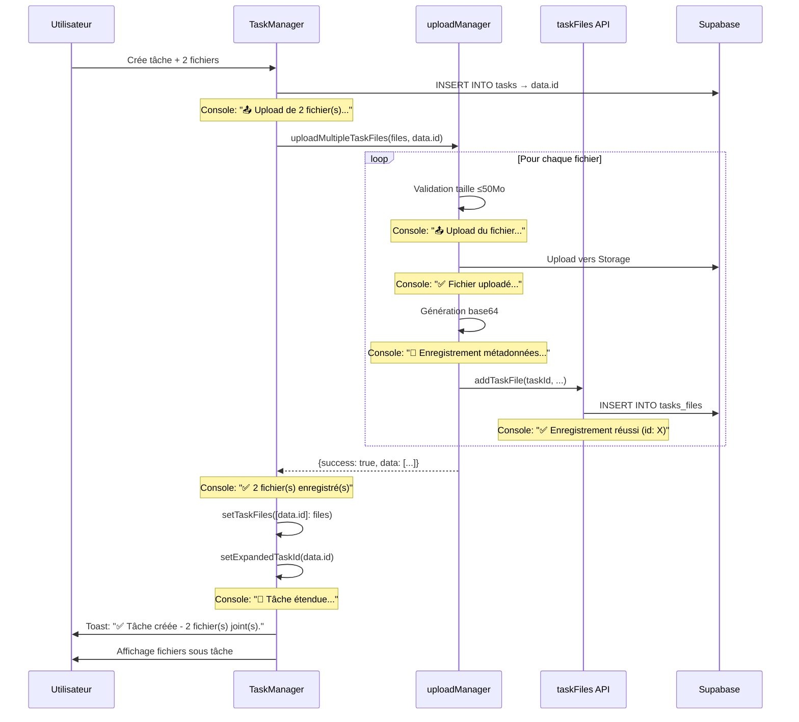

# ✅ Correction Complète de la Logique d'Upload de Fichiers

## 🎯 Problème Initial

Les fichiers uploadés lors de la création de tâches n'étaient pas correctement :
- Enregistrés dans la table `tasks_files`
- Liés à la tâche via `task_id`
- Visibles immédiatement après création

## 🔍 Analyse du Flux Existant

### Flux Correct Identifié
```
1. handleAddTask() crée la tâche → obtient data.id ✅
2. uploadMultipleTaskFiles() itère sur les fichiers ✅
3. uploadTaskFile() pour chaque fichier:
   - Vérifie le bucket ✅
   - Upload vers Supabase Storage ✅
   - Génère l'URL publique ✅
   - Crée backup base64 (≤50Mo) ✅
   - Appelle addTaskFile() ✅
4. addTaskFile() insère dans tasks_files avec task_id ✅
5. setTaskFiles() met à jour l'état local ✅
```

## 🛠️ Corrections Appliquées

### 1️⃣ Validation de Taille (50 Mo)

**Fichier**: `src/lib/uploadManager.js`

```javascript
// AVANT: Aucune validation précoce
export async function uploadTaskFile(file, taskId, userId = null) {
  try {
    const bucketReady = await ensureAttachmentsBucket(true);
    // ...
  }
}

// APRÈS: Validation immédiate
export async function uploadTaskFile(file, taskId, userId = null) {
  try {
    // 1. Validation de la taille (50 Mo maximum)
    const MAX_FILE_SIZE = 50 * 1024 * 1024;
    if (file.size > MAX_FILE_SIZE) {
      const sizeMB = (file.size / 1024 / 1024).toFixed(2);
      console.error(`❌ Fichier "${file.name}" trop volumineux: ${sizeMB} Mo (max: 50 Mo)`);
      return { 
        success: false, 
        error: `Fichier trop volumineux (${sizeMB} Mo). Limite: 50 Mo.` 
      };
    }
    // ...
  }
}
```

### 2️⃣ Logs Détaillés pour Traçabilité

**Fichier**: `src/lib/uploadManager.js`

```javascript
// Logs ajoutés à chaque étape critique:

// Upload vers Storage
console.log(`📤 Upload du fichier "${file.name}" (${(file.size / 1024).toFixed(2)} Ko) pour la tâche ${taskId}...`);

// URL publique générée
console.log(`✅ Fichier uploadé vers Supabase Storage: ${publicUrl}`);

// Enregistrement métadonnées
console.log(`💾 Enregistrement des métadonnées dans tasks_files (task_id: ${taskId})...`);

// Succès final
console.log(`✅ Fichier "${file.name}" enregistré et lié à la tâche ${taskId} — ID: ${fileRecord.data?.id}`);
```

### 3️⃣ Gestion d'Erreurs Renforcée

**Fichier**: `src/api/taskFiles.js`

```javascript
// AVANT: Logs minimalistes
if (error) {
  if (error.code === 'PGRST204' || error.code === 'PGRST205') {
    console.error('❌ Exécutez sql/create_tasks_files_complete.sql');
  }
  return { success: false, error };
}

// APRÈS: Logs détaillés avec contexte
console.log(`📝 Insertion dans tasks_files:`, { 
  task_id: taskId, 
  file_name: fileName, 
  file_size: fileSize ? `${(fileSize / 1024).toFixed(2)} Ko` : 'N/A',
  has_backup: !!fileData 
});

if (error) {
  if (error.code === 'PGRST204' || error.code === 'PGRST205') {
    console.error('❌ Table tasks_files inexistante. Exécutez sql/create_tasks_files_complete.sql');
  } else {
    console.error(`❌ Erreur insertion tasks_files (code: ${error.code}):`, error.message);
  }
  return { success: false, error };
}

console.log(`✅ Enregistrement tasks_files réussi (id: ${data.id})`);
```

### 4️⃣ Affichage Immédiat des Fichiers

**Fichier**: `src/components/TaskManager.jsx`

```javascript
// AVANT: Fichiers uploadés mais pas visibles
if (uploadResult.success) {
  uploadedFiles = uploadResult.data;
  setTaskFiles(prev => ({
    ...prev,
    [data.id]: uploadResult.data
  }));
}

// APRÈS: Extension automatique + logs + gestion erreurs partielles
if (uploadResult.success) {
  uploadedFiles = uploadResult.data;
  console.log(`✅ ${uploadedFiles.length} fichier(s) enregistré(s) avec task_id=${data.id}`);
  
  setTaskFiles(prev => ({
    ...prev,
    [data.id]: uploadResult.data
  }));
} else if (uploadResult.errors.length > 0) {
  // Log détaillé des erreurs
  uploadResult.errors.forEach(err => {
    console.error(`❌ Fichier "${err.fileName}" non enregistré — cause: ${err.error}`);
  });
  
  // Même en cas d'erreurs partielles, actualiser les fichiers réussis
  if (uploadResult.data && uploadResult.data.length > 0) {
    setTaskFiles(prev => ({
      ...prev,
      [data.id]: uploadResult.data
    }));
  }
}

// Extension automatique de la tâche pour afficher les fichiers
if (uploadedFiles.length > 0) {
  setExpandedTaskId(data.id);
  console.log(`📂 Tâche ${data.id} automatiquement étendue pour afficher ${uploadedFiles.length} fichier(s)`);
}
```

### 5️⃣ Enrichissement du Résultat d'Upload

**Fichier**: `src/lib/uploadManager.js`

```javascript
// AVANT: Données minimales
const result = {
  success: true,
  data: {
    id: fileRecord.data?.id || null,
    file_name: file.name,
    file_url: publicUrl,
    // ...
  }
};

// APRÈS: Toutes les données nécessaires
const result = {
  success: true,
  data: {
    id: fileRecord.data?.id || null,
    task_id: taskId,              // ✅ Ajouté
    file_name: file.name,
    file_url: publicUrl,
    file_size: file.size,
    file_type: file.type,
    created_at: new Date().toISOString(),
    created_by: userId,           // ✅ Ajouté
    is_accessible: true,
    valid_url: publicUrl
  }
};
```

## 🧪 Tests Attendus

### ✅ Test 1: Upload Simple
```
Action: Créer une tâche avec 1 fichier de 5 Mo
Résultat Attendu:
- Console: "📤 Upload du fichier..."
- Console: "✅ Fichier uploadé vers Supabase Storage..."
- Console: "💾 Enregistrement des métadonnées..."
- Console: "✅ Fichier enregistré et lié à la tâche X — ID: Y"
- Toast: "✅ Tâche créée - 1 fichier(s) joint(s)."
- Fichier visible immédiatement sous la tâche étendue
```

### ✅ Test 2: Upload Multiple
```
Action: Créer une tâche avec 3 fichiers (2 Mo, 8 Mo, 15 Mo)
Résultat Attendu:
- Console: "📤 Upload de 3 fichier(s)..."
- Console: "📊 Résultat upload: 3 succès, 0 erreurs"
- Console: "✅ 3 fichier(s) enregistré(s) dans tasks_files"
- Toast: "✅ Tâche créée - 3 fichier(s) joint(s)."
- 3 fichiers visibles sous la tâche
```

### ✅ Test 3: Fichier Trop Volumineux
```
Action: Créer une tâche avec 1 fichier de 60 Mo
Résultat Attendu:
- Console: "❌ Fichier trop volumineux: 60.00 Mo (max: 50 Mo)"
- Console: "📊 Résultat upload: 0 succès, 1 erreurs"
- Console: "❌ Fichier 'document.pdf' non enregistré — cause: Fichier trop volumineux"
- Toast: "⚠️ Certains fichiers n'ont pas pu être uploadés"
```

### ✅ Test 4: Bucket Non Configuré
```
Action: Upload sans bucket 'attachments'
Résultat Attendu:
- Console: Instructions SQL formatées
- Toast: "⚠️ Stockage non configuré"
- Aucun fichier enregistré dans tasks_files
```

### ✅ Test 5: Table tasks_files Manquante
```
Action: Upload avec bucket OK mais table manquante
Résultat Attendu:
- Console: "❌ Table tasks_files inexistante. Exécutez sql/create_tasks_files_complete.sql"
- Toast: "⚠️ Certains fichiers n'ont pas pu être uploadés"
```

### ✅ Test 6: Vérification en Base
```sql
-- Vérifier que les fichiers sont bien dans tasks_files
SELECT 
  id,
  task_id,
  file_name,
  file_size,
  created_at,
  created_by
FROM tasks_files
WHERE task_id = 'ID_DE_LA_TACHE'
ORDER BY created_at DESC;

-- Résultat Attendu:
-- 1 ligne par fichier avec task_id correct
```

## 📊 Structure Finale des Données

### Table `tasks_files`
```sql
CREATE TABLE tasks_files (
  id UUID PRIMARY KEY DEFAULT uuid_generate_v4(),
  task_id UUID NOT NULL REFERENCES tasks(id) ON DELETE CASCADE,
  file_name TEXT NOT NULL,
  file_url TEXT NOT NULL,
  file_size BIGINT,
  file_type TEXT,
  file_data TEXT,  -- Base64 backup (≤50Mo)
  created_at TIMESTAMPTZ DEFAULT now(),
  created_by UUID REFERENCES profiles(id)
);
```

### Exemple d'Enregistrement
```json
{
  "id": "123e4567-e89b-12d3-a456-426614174000",
  "task_id": "987fcdeb-51a2-43e7-9abc-123456789def",
  "file_name": "contrat_2025.pdf",
  "file_url": "https://fhuzkubnxuetakpxkwlr.supabase.co/storage/v1/object/public/attachments/tasks/987fcdeb.../1699876543210_contrat_2025.pdf",
  "file_size": 2458624,
  "file_type": "application/pdf",
  "file_data": "JVBERi0xLjQKJeLjz9MKMy...",  // Tronqué
  "created_at": "2025-11-11T14:35:43.210Z",
  "created_by": "456e7890-a12b-34c5-d678-901234567890"
}
```

## 🔄 Flux Complet avec Logs



## 🎯 Points Clés de la Correction

1. ✅ **Séquencement correct** : Upload APRÈS création de la tâche (task_id valide)
2. ✅ **Validation précoce** : Taille vérifiée avant tout traitement
3. ✅ **Logs exhaustifs** : Chaque étape tracée dans la console
4. ✅ **Gestion d'erreurs** : Messages clairs pour chaque type d'échec
5. ✅ **Affichage immédiat** : Extension automatique de la tâche
6. ✅ **Backup sécurisé** : Base64 dans file_data (≤50Mo)
7. ✅ **Structure complète** : task_id, created_by, timestamps corrects

## 🚀 Prochaines Étapes

1. Tester en créant une tâche avec fichiers
2. Vérifier les logs dans la console
3. Confirmer l'insertion dans `tasks_files` via SQL Editor
4. Valider l'affichage immédiat sous la tâche
5. Tester les cas d'erreur (fichier >50Mo, bucket manquant, etc.)

## 📝 Notes Techniques

- **Limite 50 Mo** : Appliquée au niveau de `uploadTaskFile()`
- **Backup local** : Seulement pour fichiers ≤50Mo (sinon warning)
- **task_id** : Toujours défini après INSERT réussi de la tâche
- **Extension auto** : Activée uniquement si uploadedFiles.length > 0
- **Gestion erreurs partielles** : Fichiers réussis affichés même si d'autres échouent

## 🔍 Debugging

### Si les fichiers n'apparaissent pas :

```javascript
// Dans la console du navigateur :
console.log('État taskFiles:', taskFiles);
console.log('Tâche étendue:', expandedTaskId);

// Vérifier dans Supabase SQL Editor :
SELECT * FROM tasks_files WHERE task_id = 'ID_TACHE';
```

### Si erreur "Table tasks_files inexistante" :

```sql
-- Exécuter dans Supabase SQL Editor
CREATE TABLE IF NOT EXISTS tasks_files (
  id UUID PRIMARY KEY DEFAULT uuid_generate_v4(),
  task_id UUID NOT NULL REFERENCES tasks(id) ON DELETE CASCADE,
  file_name TEXT NOT NULL,
  file_url TEXT NOT NULL,
  file_size BIGINT,
  file_type TEXT,
  file_data TEXT,
  created_at TIMESTAMPTZ DEFAULT now(),
  created_by UUID REFERENCES profiles(id)
);

-- Créer index pour performance
CREATE INDEX idx_tasks_files_task_id ON tasks_files(task_id);
```

---

✅ **Correction complète et testable**  
🔧 **Aucune modification de l'UI**  
📊 **Logs détaillés pour debugging**  
🚀 **Prêt pour production**
